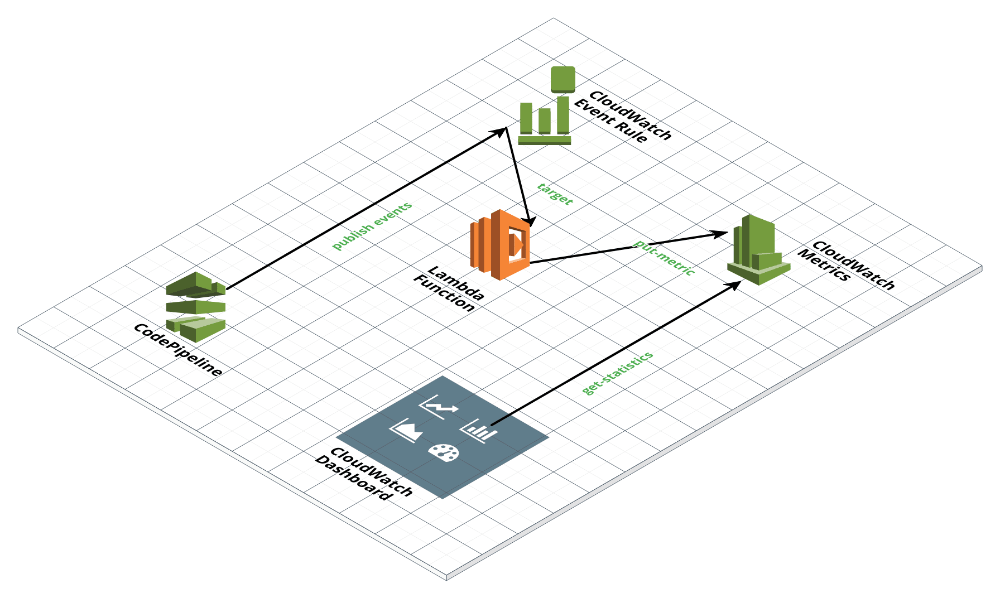
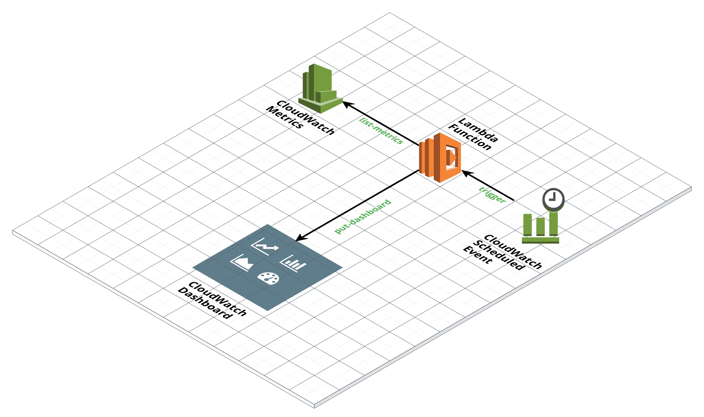
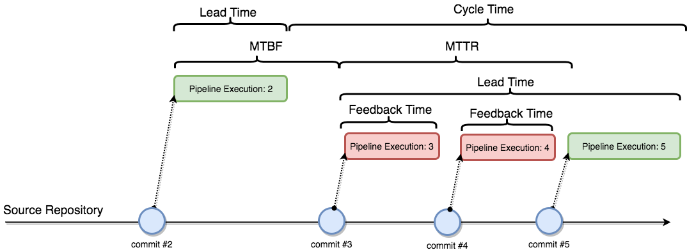
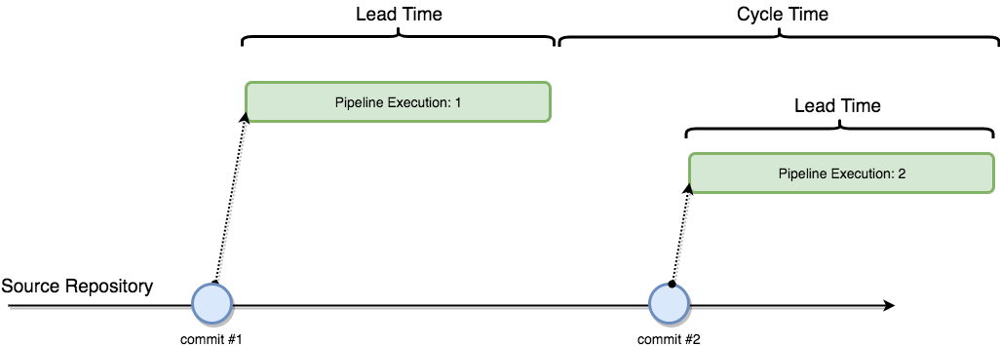

# Overview
Simple dashboard built for viewing pipeline metrics in AWS.  Built using CloudWatch dashboards and metrics populated from CloudWatch events that CodePipeline triggers. You can also deploy this dashboard directly from the AWS Serverless Application Repository [here](https://serverlessrepo.aws.amazon.com/applications/arn:aws:serverlessrepo:us-east-1:923120264911:applications~pipeline-dashboard).

For more details, see the blog post [CodePipeline Dashboard](https://stelligent.com/2017/11/16/codepipeline-dashboard/).


## Launch now!

<!--Use the **Serverless Application Repository** to deploy in your account: [Deploy Now](https://serverlessrepo.aws.amazon.com/#/applications/arn:aws:serverlessrepo:us-east-1:923120264911:applications~pipeline-dashboard)-->

Alternatively, you can deploy via CloudFormation directly:

1. From the local `pipeline-dashboard` GitHub repo, create a Zip file.
```
zip -r pipeline-dashboard.zip *.* ./src ./test
```
2. Upload the zip file to S3.

```
aws s3 mb s3://pipeline-dashboard-$(aws sts get-caller-identity --output text --query 'Account')
aws s3 sync . s3://pipeline-dashboard-$(aws sts get-caller-identity --output text --query 'Account')
```
3. Make note of the S3 Bucket and Zip file name.
4. Launch the CloudFormation stack. You will need to change the `--template-body` *value* to point to the location of the `template.yml` on your machine.
```
aws cloudformation create-stack --stack-name pipeline-dashboard-stack --template-body file:///home/ec2-user/environment/pipeline-dashboard/template.yml  --parameters ParameterKey=PipelinePattern,ParameterValue=* ParameterKey=BucketName,ParameterValue=pipeline-dashboard-ACCOUNTID ParameterKey=CodeKey,ParameterValue=pipeline-dashboard.zip --capabilities CAPABILITY_NAMED_IAM CAPABILITY_AUTO_EXPAND --disable-rollback
```

# Architecture

As seen in the diagram below, a Lambda function is triggered from a CloudWatch Event rule for CodePipeline events.  The Lambda function then generates CloudWatch metrics.  The CloudWatch dashboard is then build from the metrics that the Lambda function created.


The list of pipelines in the dashboard cannot be generated dyanmically so another Lambda function runs regulary to regenerate the dashboard based on whatever metrics have been created.



# Metric Details



| Metric | Description | How to Calculate | How to Interpret |
| -------| ----------- | ---------------- | ---------------- |
| `Cycle Time` | How often software is being delivered to production.  | The mean interval of time between two consecutive successful pipeline executions. | If this number is less than `Lead Time` then many commits are being delivered to the pipeline before a previous commit is complete.  If this number is significantly greater than `Lead Time` then the pipeline is delivering risky deployments due to the large batch size of the commits. |
| `Lead Time` | How long it takes for a change to go to production.  | The mean amount of time from commit to production, including rework. | This is the number the business cares about most, as it represents how long it takes for a feature to get into the hands of the customer.  If this number is too large, look at improving the availability of the pipeline `(MTBF / MTBF + MTTR)`. |
| `MTBF` | How often does the pipeline fail.  | The mean interval of time between the start of a successful pipeline execution and the start of a failed pipeline execution.| This number should be high in comparison to `MTTR`.  If this number is low, then consider improving the reliability of the pipeline by first researching if the root cause is the quality of new code being committed, or the repeatability of the infrastructure and test automation. |
| `MTTR` | How long does it take to fix the pipeline.  | The mean interval of time between the start of a failed pipeline execution and the start of a successful pipeline execution.| This number should be low as it is a measure of a team's ability to "stop the line" when a build fails and swarm on resolving it. If the `Feedback Time` is high, then consider addressing that, otherwise the issue is with the team's responsiveness to failures.|
| `Feedback Time` | How quick can we identify failures.  | The mean amount of time from commit to failure of a pipeline execution.  | This number should be low as it affect `MTTR`.  Ideally, failures would be detected as quick as possible in the pipeline, rather than finding them farther along in the pipeline.  |

## Cycle Time vs. Lead Time
`Cycle Time` and `Lead Time` are frequently confused.  For a good explanation, please see [Continuous Delivery: lead time and cycle time](http://www.caroli.org/continuous-delivery-lead-time-and-cycle-time/).  To compare the two metrics consider the following scenarios.  Notice that `Lead Time` is the same for the pipelines in both scenarios, however the cycle time is much smaller in the second scenario due to the fact that the pipelines are running in parallel (higher `WIP`).  This agrees with the formula `Lead Time = WIP x Cycle Time`:


*Fig.1 - Pipelines in series*


*Fig.2 - Pipelines in parallel*


# Development

To run the unit tests: `npm test`

To deploy the CodeBuild project for staging the templates: `npm run create-codebuild` or `npm run update-codebuild`

To deploy to your account: `npm run deploy`
You can change the bucket via `npm config set pipeline-dashboard:staging_bucket my-bucket-name`

