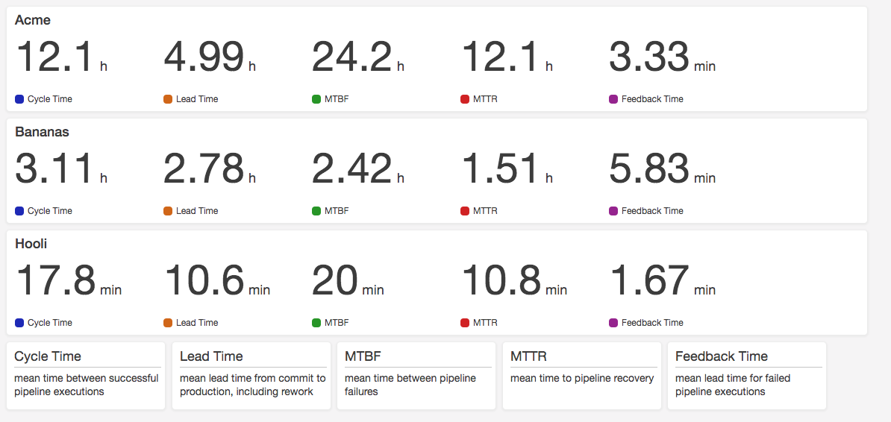

# Overview
Simple dashboard built for viewing pipeline metrics in AWS.  Built using CloudWatch dashboards and metrics populated from CloudWatch events that CodePipeline triggers.

**Launch now!**

| us-east-1 | us-west-2 |
| --------- | --------- |
|  |  |

As seen in the diagram below, a Lambda function is triggered from a CloudWatch Event rule for CodePipeline events.  The Lambda function then generates CloudWatch metrics.  The CloudWatch dashboard is then build from the metrics that the Lambda function created.

The list of pipelines in the dashboard cannot be generated dyanmically so another Lambda function runs regulary to regenerate the dashboard based on whatever metrics have been created.

# Sample Dashboard

# Development

To run the unit tests: `npm test`

To stage the lambda code and CloudFormation template: `npm run stage`
You can change the region via `npm config set pipeline-dashboard:region us-west-2`

To deploy to your account: `npm run deploy`
You can change the bucket via `npm config set pipeline-dashboard:staging_bucket my-bucket-name`

